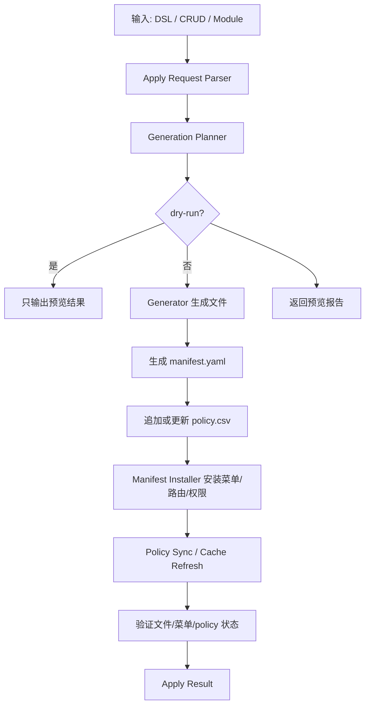
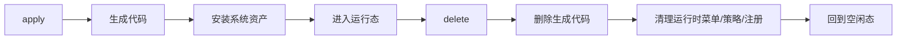

# GoAdmin CodeGen 一键生成并安装设计方案 v1.0（Production Ready）

> **定位**：GoAdmin CodeGen 的“生成 + 安装”一键化编排方案文档。
>
> **目标**：把现有“先生成代码、再单独安装”的两步流程，收敛为一个可重复执行、可预览、可回滚、可验证的一键命令，使生成出的模块、菜单、路由、权限与 `manifest.yaml` 能够同步进入系统运行态。
>
> **约束**：
>
> - 严格遵循 `docs/teckdesign/1.GoAdmin 架构设计 v1.1.md`
> - 保持 clean-room，不复用 Gin-Vue-Admin 的源码、目录结构、接口签名或安装逻辑
> - 一键流程必须支持增量执行，不能默认覆盖人工手写代码
> - `server/core/auth/casbin/adapter/policy.csv` 作为 Casbin policy 的源头，DB 模式必须自动跟随 `csv` 变化
> - 一键流程与现有删除链路必须形成“生命周期配对”，但不是严格数学意义上的无损逆操作

---

# 1. 设计背景

当前 GoAdmin CodeGen 已经具备以下能力：

- 生成后端模块骨架
- 生成 CRUD 代码、前端页面、路由与权限定义
- 生成 `manifest.yaml`
- 将 `policy.csv` 追加到文件策略源
- 通过 `manifest` 安装菜单到数据库
- 通过删除链路清理生成代码、运行时菜单与策略

但现有能力仍然是分散的：

- 生成与安装是两个独立动作
- 用户需要手工决定先生成再安装
- 不同入口之间容易出现“生成成功但未安装”或“安装失败但文件已落盘”的状态不一致问题
- CLI / HTTP / UI 需要复用同一套编排规则，否则会出现行为差异

因此，需要补齐一个 **`apply` 一键流程**，把“生成代码 + 安装系统资产”合并为单次编排。

---

# 2. 设计目标

## 2.1 核心目标

一键流程应当至少完成以下事情：

- 基于统一输入生成模块或 CRUD 代码
- 同步生成 `manifest.yaml`
- 同步追加或更新 `policy.csv`
- 解析 `manifest.yaml` 并安装菜单、路由或权限元数据
- 刷新运行态所需的注册与缓存
- 输出清晰的执行结果、安装结果与冲突提示

## 2.2 体验目标

用户在 CodeGen 控制台、HTTP API 或 CLI 中应能完成以下流程：

1. 填写 DSL / CRUD / 模块输入
2. 预览生成计划
3. 一键执行 `generate + install`
4. 系统自动接入菜单、权限与路由
5. 执行完成后可直接看到运行态结果

## 2.3 工程目标

一键流程必须满足：

- 幂等
- 可重复执行
- 可审计
- 可追踪来源
- 可与删除链路配对
- 可在本地直写与服务端执行两种场景下复用

---

# 3. 术语定义

## 3.1 `apply`

本文档中的 `apply` 指的是：

- 生成代码资产
- 写入派生配置资产
- 安装运行时数据到系统

它不是单纯的文件生成，也不是单纯的数据库导入。

## 3.2 `delete`

`delete` 是与 `apply` 配对的反向生命周期能力，负责：

- 删除生成的代码资产
- 回收由生成器接管的运行时菜单、策略与注册信息
- 保留共享资源和人工资产

`delete` 与 `apply` 形成模块生命周期闭环，但它们不是严格对称的完整回滚关系。

## 3.3 源头与跟随

- `policy.csv` 是 Casbin policy 的源头
- DB 只负责跟随 `policy.csv` 的变化
- DB 不应被视为第二份独立真相

---

# 4. 适用范围

## 4.1 本方案覆盖

本方案覆盖以下内容：

- `generate + install` 的一键编排
- 生成结果与安装结果的统一返回结构
- `manifest.yaml` 的解析与安装
- 菜单 / 路由 / 权限的接入
- `policy.csv` 的追加与 DB 跟随策略
- CLI / HTTP / UI 的统一入口建议
- 与删除链路的生命周期配对方式

## 4.2 本方案不覆盖

本方案不展开以下内容：

- 模板系统的具体渲染实现
- 代码生成的字段映射细节
- 前端页面模板细节
- 删除链路的详细执行器设计
- 插件市场分发协议

这些内容由现有 CodeGen 架构文档、安装文档与删除文档承接。

---

# 5. 总体架构

## 5.1 运行链路

```text
CLI / HTTP API / UI
        ↓
Apply Request Parser
        ↓
Generation Planner
        ↓
Generator
        ↓
Manifest Installer
        ↓
Policy Sync / Cache Refresh
        ↓
Apply Result
```

## 5.2 生命周期配对

```text
apply  = generate + install + refresh
delete = plan + cleanup + verify
```

配对关系如下：

- `apply` 负责把模块接入系统
- `delete` 负责把模块从系统中移除
- 两者都必须建立在“生成归属可追踪”的前提下
- 两者都必须支持预览与验证

## 5.3 设计原则

### 5.3.1 编排优先

`apply` 不是新的生成器，而是 `server/codegen/application/apply` 中的编排层：

- 先调用生成能力
- 再调用安装能力
- 再执行同步与验证

### 5.3.2 结果一致性

生成计划与安装计划必须共享同一份输入，避免预览和执行不一致。

### 5.3.3 增量优先

默认不能覆盖人工手写内容：

- 文件存在时优先合并
- 冲突时提示而不是强制覆盖
- 需要 `force` 时才允许更强写入

### 5.3.4 源头单一

- 文件策略以 `policy.csv` 为源头
- DB 通过启动同步或安装后的同步机制自动跟随
- 安装动作不应再创建第二套独立 policy 真相

## 5.4 接口示意图

```text
┌──────────────────────────────────────────────────────────────┐
│                       入口层 / Presentation                   │
│   CLI: codegen apply                                          │
│   HTTP: POST /api/v1/codegen/apply/*                          │
│   UI: CodeGen 控制台                                           │
└──────────────────────────────────────────────────────────────┘
                              ↓
┌──────────────────────────────────────────────────────────────┐
│                        应用编排层 / server/codegen/application/apply                       │
│  - 统一解析输入                                                │
│  - 生成计划                                                    │
│  - 编排生成、安装、同步、验证                                  │
└──────────────────────────────────────────────────────────────┘
               ↓                         ↓                       ↓
┌──────────────────────┐   ┌──────────────────────┐   ┌──────────────────────┐
│   Generator           │   │   Manifest Installer  │   │   Policy Sync        │
│  - write files        │   │  - parse manifest     │   │  - follow policy.csv │
│  - write manifest     │   │  - upsert menus       │   │  - refresh cache     │
│  - append policy.csv  │   │  - refresh runtime    │   │                      │
└──────────────────────┘   └──────────────────────┘   └──────────────────────┘
               ↓                         ↓                       ↓
┌──────────────────────┐   ┌──────────────────────┐   ┌──────────────────────┐
│ Filesystem / Repo    │   │ System DB / Menu Tree │   │ Casbin DB / Cache    │
│ server / web / docs │   │ menus / routes / meta │   │ policy_rule / reload │
└──────────────────────┘   └──────────────────────┘   └──────────────────────┘
```

## 5.5 生命周期流程图



## 5.6 与 delete 的配对流程



---

# 6. 一键流程设计

## 6.1 输入

`apply` 的最小输入建议包括：

- 模块名
- 生成类型：`module` / `crud` / `plugin` / `dsl` / `db`
- `force`
- 是否生成前端
- 是否生成 policy
- 是否执行 install
- 是否刷新缓存
- 是否 dry-run

## 6.2 输出

统一输出建议包括：

- 生成摘要
- 文件变更摘要
- 安装摘要
- policy 同步摘要
- 告警与冲突
- 执行状态

## 6.3 执行顺序

最小可行顺序如下：

1. **预览**
   - 计算将生成的文件
   - 计算将安装的菜单与权限
   - 计算将追加的 policy 变更

2. **生成**
   - 写入代码目录
   - 写入 `manifest.yaml`
   - 追加 `policy.csv`

3. **安装**
   - 解析 `manifest.yaml`
   - upsert 菜单、路径与相关运行时元数据
   - 必要时刷新菜单缓存

4. **同步**
   - `db` 模式下 Casbin 自动跟随 `policy.csv`
   - 需要时刷新权限缓存

5. **验证**
   - 文件是否生成成功
   - 菜单是否写入成功
   - `policy.csv` 是否可解析
   - DB 侧是否已按预期接入

---

# 7. 与现有实现的关系

## 7.1 生成侧

现有生成能力已经具备：

- `GenerateModule`
- `GenerateCRUD`
- `GeneratePlugin`
- `GenerateManifest`
- `AppendPolicyLines`

`apply` 不需要重写这些能力，只需要把它们编排起来。

## 7.2 安装侧

现有安装能力已经具备：

- 读取 `manifest.yaml`
- 解析菜单
- 创建或更新菜单树

`apply` 只需要在生成完成后调用安装服务即可。

## 7.3 删除侧

现有删除能力已经具备：

- 删除生成文件
- 清理运行时菜单
- 清理 policy
- 刷新注册表
- 处理共享资源和冲突

因此，`apply` 和 `delete` 可以形成如下对应关系：

- `apply`：创建、安装、接入
- `delete`：回收、清理、移除

---

# 8. 命令与入口设计

## 8.1 CLI 建议

建议在现有 CLI 中新增：

- `codegen apply module`
- `codegen apply crud`
- `codegen apply plugin`
- `codegen apply dsl`
- `codegen apply db`

其中：

- `generate` 可以保留为“仅生成”
- `apply` 则表示“生成 + 安装”
- `remove` 保留为“删除 + 清理”

## 8.2 HTTP API 建议

建议新增一组接口作为一键入口：

- `POST /api/v1/codegen/apply/preview`
- `POST /api/v1/codegen/apply/execute`

如需兼容现有生成接口，也可以在现有 API 下增加 `install` 选项，但推荐使用独立语义更清晰的 `apply`。

## 8.3 UI 建议

CodeGen 控制台建议提供：

- 生成输入区
- 预览区
- 一键执行按钮
- 执行结果区
- 安装结果区
- 冲突与告警区

---

# 9. 数据一致性与幂等性

## 9.1 文件侧幂等

- 文件已存在时，默认按增量策略处理
- 相同 policy 行必须去重
- 重复 apply 不应生成重复策略
- 生成结果应尽量稳定可重放

## 9.2 DB 侧幂等

- 菜单安装使用 upsert 语义
- 以 `path`、`parent_path`、`permission` 等稳定键识别资源
- 重复 apply 不应插入重复菜单记录

## 9.3 policy 侧幂等

- `policy.csv` 仍是文件侧源头
- DB 模式下自动跟随 `csv`
- 安装动作不应写出一份独立的 policy 真相

---

# 10. 风险与约束

## 10.1 不应强行等同于无损回滚

`apply` 与 `delete` 不是严格逆操作，原因包括：

- 共享资源可能被多个模块引用
- 人工手工修改可能混入生成目录
- DB 运行时数据可能在生成后发生独立变化

## 10.2 不应默认删除业务数据

`delete` 只负责模块资产和运行态接入项，不默认处理业务表数据。

## 10.3 不应把 DB policy 变成第二份来源

如果 DB 与 `policy.csv` 冲突，应优先保持 `csv` 为源头，并通过启动同步或安装同步保持 DB 跟随。

---

# 11. 推荐实施路径

## 11.1 最小实现

先做一个轻量编排层：

1. 复用现有生成器
2. 复用现有安装器
3. 新增 `apply` 命令入口
4. 让 `apply` 输出统一结果结构

## 11.2 后续演进

后续可再补：

- `apply` 预览接口
- `apply` 结果审计
- 更完整的冲突解决策略
- Web 控制台的一键执行页
- 与删除链路对称的生命周期管理界面

---

# 12. 验收标准

## 12.1 功能验收

- `apply` 可以一次完成生成 + 安装
- `delete` 可以完成反向清理
- 两者都能被 CLI 使用
- 安装后菜单和权限可直接生效
- `policy.csv` 更新后 DB 能自动跟随

## 12.2 工程验收

- 幂等执行不产生重复脏数据
- 失败时输出明确错误原因
- 共享资源不会被误删
- 手工内容不会被默认覆盖

## 12.3 文档验收

- `apply` 与 `delete` 的职责边界明确
- 一键流程与现有架构文档一致
- 团队可以按文档实现 CLI / API / UI 入口

---

# 13. 结论

一键 `generate + install` **应该做**，并且最合理的落点是新增一个 `apply` 编排命令：

- `apply` = 生成 + 安装 + 刷新
- `delete` = 计划 + 清理 + 验证

这样可以形成完整的模块生命周期闭环，同时保持实现上的最小改动和最大复用。
